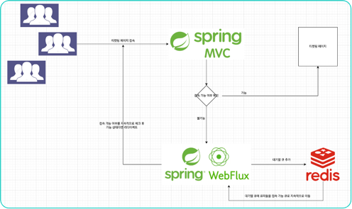
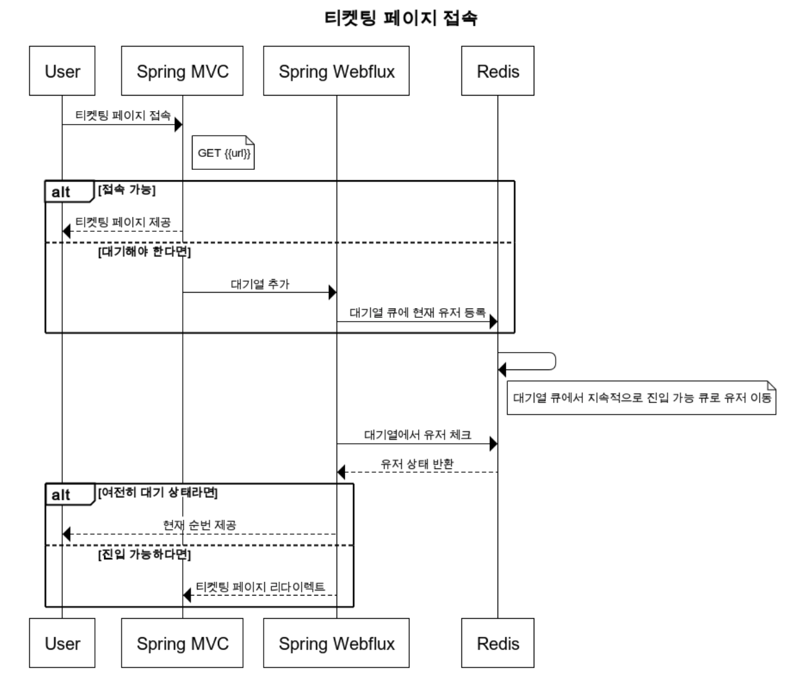

# PJ2. 티켓팅 접속자 대기열 시스템

Reactive Redis, Spring Webflux 집중 탐구 프로젝트 By.최치원

---

## 📌 프로젝트 목적

- Redis, Spring Webflux 집중 탐구 프로젝트
- Spring Webflux와 Spring MVC 차이 이해하기
- 티켓팅, 쿠폰 이벤트, 수강 신청과 같은 스파이크 성 트래픽 부하를 견딜 수 있는 애플리케이션 개발
- Reactive Redis로 접속 대기열 큐 구현

---

## 🧰 기술 스택

| 항목     | 내용                                                                       |
|--------|--------------------------------------------------------------------------|
| 언어     | Java 21                                                                  |
| 빌드 도구  | Gradle (Build, Multi Module)                                             |
| 개발     | Spring Boot 3.4.4, Spring Webflux 6.2.5 Spring MVC 6.2.5, Docker (Redis) |
| 데이터    | Redis 7.4, Redis Reactive 3.4.4, Embedded Redis (테스트용)                   |
| 성능 테스트 | JMeter                                                                   |

---

## 📈 주요 기능

| 컴포넌트        | 기능 항목             | 상태 |
|-------------|-------------------|----|
| **티켓팅 페이지** | 티켓팅 화면 접속         | ✅  |
| **대기열 큐**   | 접속자 대기열 큐         | ✅  |
|             | 접속 허가 큐           | ✅  |
|             | 접속 가능 여부 지속 체크    | ✅  |
|             | 접속 가능 여부 전환       | ✅  |
|             | 현재 사용자 순번 확인      | ✅  |
|             | 대기열 이탈 시 체크 토큰    | ✅  |
|             | 스케쥴러를 이용한 대기큐 비우기 | ✅  |

---

## 🏛️ Architecture

--- 

## 🔜 Sequence Diagram

